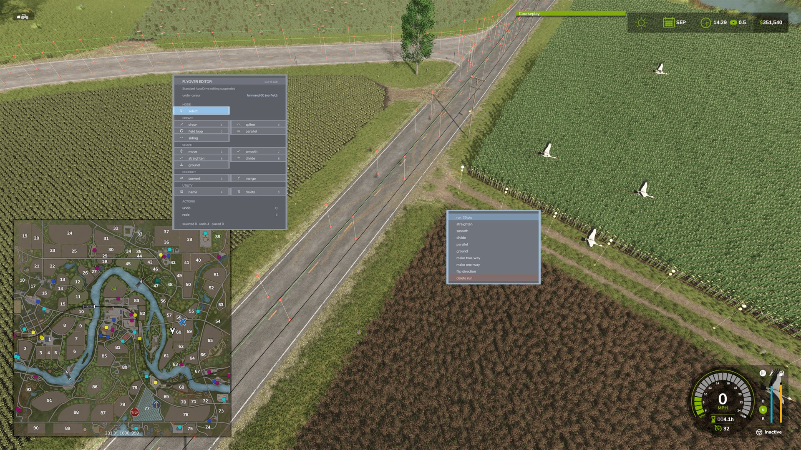

# Flyover Editor for AutoDrive

A top-down flyover editor for [AutoDrive](https://github.com/Stephan-S/FS25_AutoDrive) route
networks in **Farming Simulator 25** — build and repair routes from above, on foot or in a vehicle,
without driving every metre of them.

It runs as a **companion mod** beside *stock* AutoDrive: it does not modify AutoDrive's files, it
attaches at runtime, and it refuses to load (and says why) if AutoDrive isn't there.

*Top-down editing of an AutoDrive route — the grouped tool panel, a run's context menu, and the network drawn over the map.*

> **Status:** build 0.29.4.0 · single player only · requires `FS25_AutoDrive`

## Install

1. Download **`FS25_ADFlyoverEditor.zip`** from the [latest release](../../releases/latest) — keep the
   filename exactly.
2. Drop it into your FS25 `mods` folder, e.g.
   `…/Documents/My Games/FarmingSimulator2025/mods/`.
3. In the in-game mod list, enable it alongside **FS25_AutoDrive**.

Don't run it next to a modified AutoDrive build that already includes its own flyover editor (an
AutoDrive fork, say) — both provide the editor, and whichever loads last wins.

## Opening the editor

- **Left Alt + F** (rebindable in the controls menu), or the button beside AutoDrive's HUD.
- **Esc** to leave. Every edit is undoable — **Q** undo, **E** redo.

## Tools

Grouped by job on the panel. **Select** is the default mode: no tool held, click things to edit them.

| Group | Tools |
|---|---|
| **Create** | `draw` connect waypoints · `spline` curved connection · `field loop` headland loop around a field · `parallel` a track alongside a span · `siding` a spur splined in at both ends |
| **Shape** | `move` drag a point, with falloff along the track · `smooth` · `straighten`, which keeps real bends · `divide` add evenly-spaced points · `ground` settle points onto the surface |
| **Connect** | `convert` one-way / two-way and priority · `merge` join nearby nodes |
| **Utility** | `name` label a waypoint · `delete` remove a point, span or run |

## Working with it

- **Select mode** — click a **point**, a **span** (a second click, or a double-click for the whole
  span), or a whole **run** between junctions to get a context menu of edits for it, with the target
  highlighted in the world.
- **Floating tool card** — a tool's controls appear on a small card near the cursor instead of in a
  far corner. Numeric settings can be **typed, scrolled, or nudged with − / + steppers**, and the
  wheel adjusts whichever field you are hovering. **Middle-click** hides the card and lets a drag
  pass through it.
- **Span / run tools** (straighten, smooth, divide, ground, parallel) act on a picked span or a whole
  run: arm the tool, dial its setting, right-click to apply.

## Compatibility & safety

- Reads and writes AutoDrive's route network only through AutoDrive's own API — **no changes to
  AutoDrive's files**.
- Its own settings live under `modSettings/FS25_ADFlyoverEditor/` and never touch AutoDrive's config
  or your savegame's `AutoDrive_config.xml`.
- Single player only.

## Development & internals

The mod attaches to a stock, unmodified AutoDrive at runtime: it resolves AutoDrive's Lua
environment, republishes the names it needs, re-centres the network draw on a cursor instead of the
vehicle, and wraps the handful of functions an AutoDrive fork would otherwise have edited. The how
and why:

| Doc | |
|---|---|
| [`docs/companion-build-plan.md`](docs/companion-build-plan.md) | how the mod is put together, stage by stage |
| [`docs/flyover-input-context.md`](docs/flyover-input-context.md) | the input-context and camera pitfalls — **read before touching those** |
| [`docs/flyover-gui-redesign.md`](docs/flyover-gui-redesign.md) | the GUI redesign spec |
| [`docs/bugs.md`](docs/bugs.md) | known bugs, and closed ones with their causes |
| [`docs/probe-results.md`](docs/probe-results.md) | the raw in-game measurements the rest cite |
| [`docs/build-log.md`](docs/build-log.md) | the staged bring-up log and its in-game verification steps |

### Versioning

Two numbers, because one cannot answer the question honestly. `P.BUILD` in `Prelude.lua` is
re-sourced every time a savegame loads, so it always describes the Lua actually running. `modDesc`'s
version is read by the mod manager at **game startup only**. So reloading a savegame from the main
menu is enough for Lua changes; a full restart is needed only when `modDesc.xml` itself changes. When
the two disagree the version line says so — e.g.
`build 0.29.4.0 (modDesc says 0.29.3.0 - stale, full restart to refresh it)` — which is
informational, not a fault.

### Repository layout

| Path | |
|---|---|
| `scripts/Prelude.lua` | the only `<extraSourceFiles>` entry; orders everything |
| `scripts/Arming.lua` | resolves AutoDrive: listener scan → `getfenv` → republish |
| `scripts/Proxy.lua` | the stand-in `self` that re-centres the network on the cursor |
| `scripts/Wrappers.lua` | the fork's edits, re-expressed as runtime wrappers |
| `scripts/Settings.lua` | companion-owned settings; never touches `AutoDrive.settings` |
| `scripts/editor/` | the editor itself — tools, HUD, and geometry |
| `tools/` | asset generators (`make_tool_icons.py`, `make_icon.py`), excluded from the packaged mod |

Nothing but `Prelude.lua` may go in `<extraSourceFiles>`: the editor files write into AutoDrive's
table at source time, and AutoDrive is unresolvable then.

## Credits & acknowledgements

By huskermcdoogle. Built to run against [Stephan-S/FS25_AutoDrive](https://github.com/Stephan-S/FS25_AutoDrive)
(MIT); not affiliated with or endorsed by the AutoDrive team.

The field-loop feature was *inspired* by [Courseplay](https://github.com/Courseplay/Courseplay_FS25)'s
field-course generation, but its geometry here is an **independent implementation** written from
published algorithms (Taubin smoothing, Chaikin subdivision, standard polygon offsetting) and Giants'
own field API — see the header of [`OffsetGeometry.lua`](scripts/editor/OffsetGeometry.lua). None of
Courseplay's GPL-licensed code is used or derived from.

## License

[MIT](LICENSE) © 2026 huskermcdoogle.
